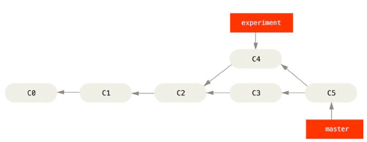
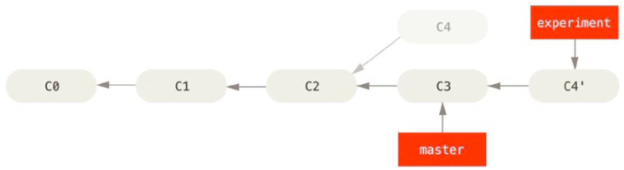
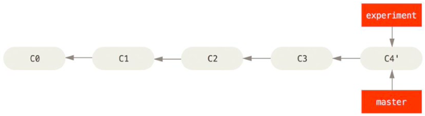
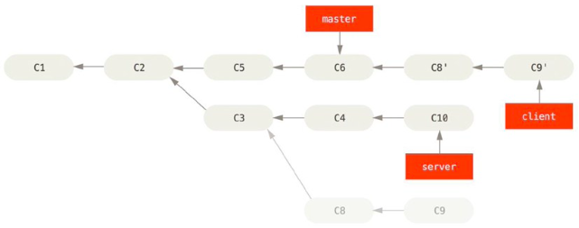
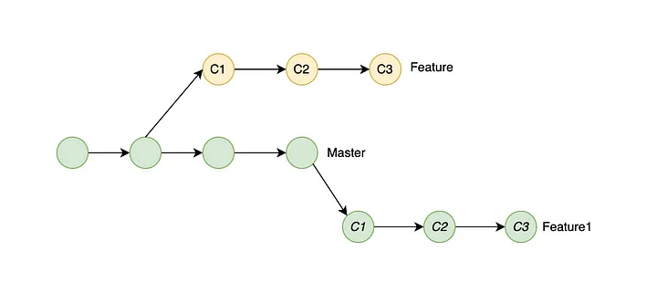

# Rebasing and Cherry-Picking Project
by **Gabriela Moravčíková, Terézia Blihárová, Emma Fössing**

## Table of contents 
1. [Introduction](#introduction)
2. [Rebasing](#rebasing)   
3. [Cherry-Picking](#cherry-picking)
4. [Sources](#sources)


## Introduction
Rebasing and cherry-picking come to use when the work has diverged and branches were created. They are tools used by repository maintainers instead of merging branches from other contributers. The main advantage it has to the classical merge is the ability to maintain a mostly linear history ([Chacon & Straub, 2014](#pro-git-book)).

## Rebasing
### General idea of it
The ```git rebase [basebranch]``` command takes all the commits of the currently checked out branch (topicbranch) and applies them on the basebranch, usually the master branch, which has to be specified in the command.
The rebase command finds the common anchestor of the two branches and finds the differences to this made on the topicbranch with each commit. These are temporarily stored, the topicbranch is then reset to the same commit as the basebranch and then the changes are applied to the basebranch. To have a clear linear commit history and the pointers to both point at the same commit, the basebranch has to be checked out and then a fast-forwad merge can be applied ([Chacon & Straub, 2014](#pro-git-book)).

#### Visual representation

*This is what the initial situation might look like. C4 was commited on a seperate branch and now it should be applied to the master branch.* <br>


*This is what the situation looks like after running the rebase command* <br>


*This is the final history after the merge fast-forward.* <br>

There will not be any difference between the files after the rebasing or the applying of the ```merge``` command. Only the git history will be different as the log history looks linear ([Chacon & Straub, 2014](#pro-git-book)). 

A neccessity for rebasing is to have a branch checked out and a configured upstream, otherwise the command will abort ([Git-rebase documentation](#git-scm)).


There are some additional arguments that can be applied to the ```rebase``` command. <br>
Running ``` git rebase [basebranch] [topicbranch]``` the topicbranch does not have to be checked out initially. <br>
Problematic commits will cause git to report a merge conflict which can be resolved manually and then one has the option to ```rebase --continue``` or ```rebase --abort``` ([Git-rebase documentation](#git-scm)). <br>
After a topicbranch was rebased, the information is integrated on the basebranch and if the topicbranch is not used anymore it can be deleted with ```git branch -d [topicbranch]```.

If there are multiple branches and the topicbranch does not have a direct common anchestor with the basebranch as it is branching out from a further branch, then ```--onto``` can be used ([Chacon & Straub, 2014](#pro-git-book)).
#### Visual representation

*This is the client branch (commits C8 and C9) rebased onto the master branch (commits C8' and C9'). The command used for this is  ```git rebase --onto master server client``` ([Chacon & Straub, 2014](#pro-git-book))*. <br>

This is the same as ```git reset --hard [upstream]```. There are many branch scenarios in which ```--onto``` can be used, for more see the [Git-rebase documentation](#git-scm).

And similar to rebasing, there exists also [Cherry-picking](#cherry-picking), which follows the same idea and a good tool for more picky maintainers.

### Advantage

## Cherry-Picking
### General idea of it
Cherry-picking is a proccess to manually pick commints from one branch and introduce them from another branch. This feature is particularly usefull if we have a number of commits on the topic branch and we want to integrate only one of them. We use the ```git cherry-pick``` command to take the changes introduced in a single Git commit and try to re-introduce it as a new commit on the branch we are currently on. 
### Example
### Visual Representation 

### Advantage


## Sources

- <a id="git-scm"></a> Git-rebase documentation. https://git-scm.com/docs/git-rebase; retrieved on 11/10/2023.

- <a id="pro-git-book"></a> Chacon, S., & Straub, B. (2014). *Pro git*. Springer Nature.
